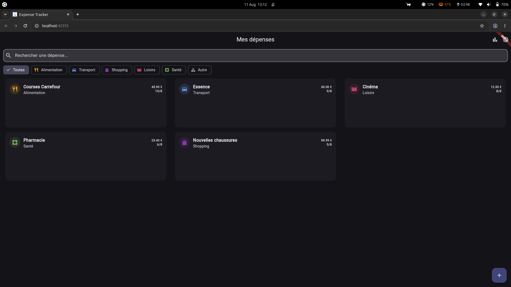
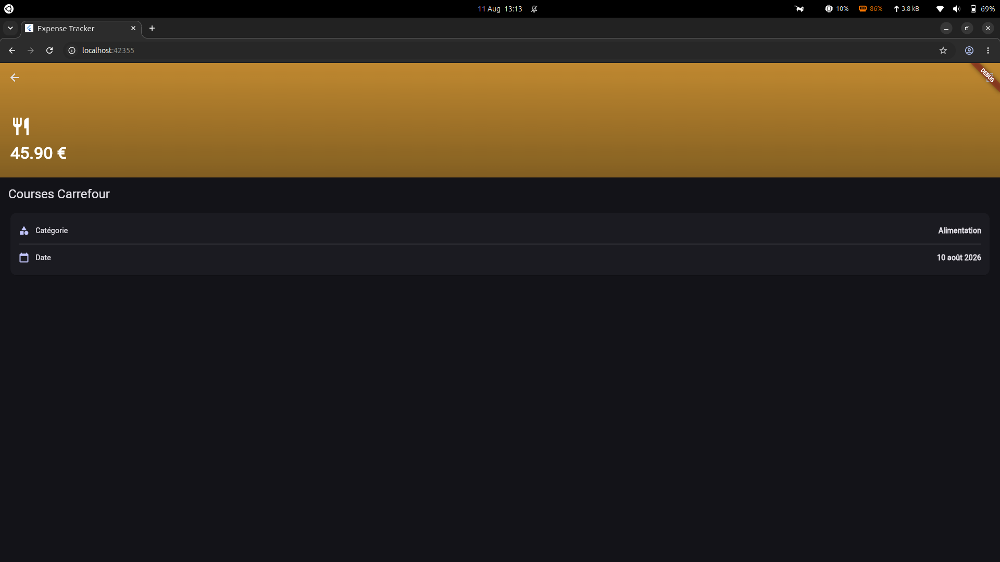
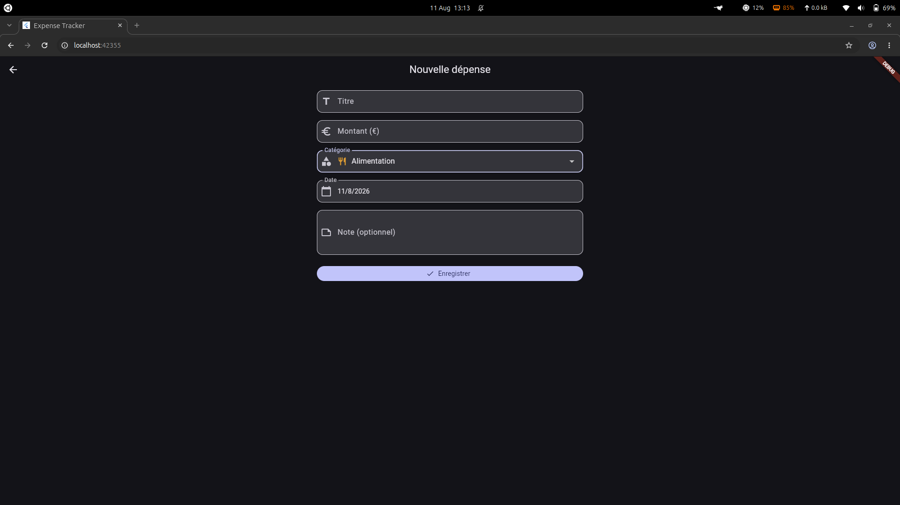
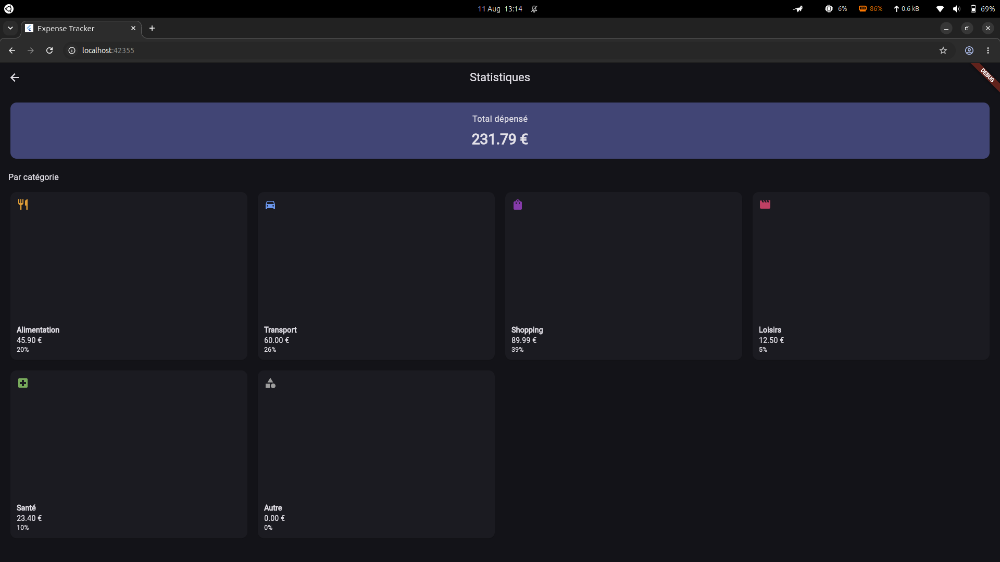

# 💰 Expense Tracker

Application Flutter de suivi de dépenses personnelles — projet de certification NextFlutter.

## 👤 Auteur

**Rafanomezantsoa Tolotriniaina Valisoa**
 valisoatolotriniaina@gmail.com
 Discord : valisoa01

##  Présentation du projet

Ce projet a été réalisé dans le cadre du **projet de certification Flutter** de NextFlutter, avec pour objectif de valider la maîtrise des widgets Flutter et de la navigation à travers la construction d'une application complète et fonctionnelle.

L'application choisie est un **suivi de dépenses personnelles (Expense Tracker)**, permettant d'enregistrer, consulter, filtrer et analyser ses dépenses au quotidien, réparties par catégorie.

Le projet a été développé selon une **méthode itérative par petites étapes** : chaque fonctionnalité a été développée sur une branche Git dédiée, testée manuellement, puis fusionnée dans `main` via Pull Request — garantissant à chaque étape une application fonctionnelle et un historique de développement clair et traçable.

##  Fonctionnalités

-  **Liste des dépenses** avec recherche en temps réel et filtrage par catégorie
- **Écran de détail** avec header immersif dégradé et suppression (avec confirmation)
- **Formulaire d'ajout** avec validation complète (titre, montant, catégorie, date, note)
-  **Statistiques** : total dépensé et répartition par catégorie
-  **Thème clair/sombre**
-  **Interface responsive** (mobile, tablette, desktop)

##  Architecture#  Expense Tracker

Application Flutter de suivi de dépenses personnelles — projet de certification NextFlutter.

##  Auteur

**Rafanomezantsoa Tolotriniaina Valisoa**
 valisoatolotriniaina@gmail.com
 Discord : valisoa01

##  Présentation du projet

Ce projet a été réalisé dans le cadre du **projet de certification Flutter** de NextFlutter, avec pour objectif de valider la maîtrise des widgets Flutter et de la navigation à travers la construction d'une application complète et fonctionnelle.

L'application choisie est un **suivi de dépenses personnelles (Expense Tracker)**, permettant d'enregistrer, consulter, filtrer et analyser ses dépenses au quotidien, réparties par catégorie.

Le projet a été développé selon une **méthode itérative par petites étapes** : chaque fonctionnalité a été développée sur une branche Git dédiée, testée manuellement, puis fusionnée dans `main` via Pull Request — garantissant à chaque étape une application fonctionnelle et un historique de développement clair et traçable.

##  Fonctionnalités

-  **Liste des dépenses** avec recherche en temps réel et filtrage par catégorie
-  **Écran de détail** avec header immersif dégradé et suppression (avec confirmation)
-  **Formulaire d'ajout** avec validation complète (titre, montant, catégorie, date, note)
-  **Statistiques** : total dépensé et répartition par catégorie
-  **Thème clair/sombre**
-  **Interface responsive** (mobile, tablette, desktop)

## Architecture

lib/
├── models/ # Structures de données pures (Expense, ExpenseCategory)
├── data/ # Source des données (ExpenseRepository, mock en mémoire)
├── providers/ # Gestion d'état (ExpenseProvider, ThemeProvider)
├── theme/ # Définitions ThemeData clair/sombre
├── routes/ # Configuration GoRouter (routes nommées)
├── screens/ # 4 écrans : Home, Detail, Add, Stats
├── widgets/ # Composants réutilisables (ExpenseCard, SearchField, CategoryFilterBar)
└── utils/ # Utilitaires (Responsive)

Séparation stricte UI / données : aucun widget ne contient de donnée en dur, tout transite par les providers, alimentés par le repository.

## 🛠️ Stack technique

- **Flutter** 3.44.8 / **Dart** 3.12.2
- **provider** ^6.1.5 — gestion d'état (ChangeNotifier)
- **go_router** ^17.4.0 — navigation déclarative avec routes nommées et paramètres

## 🚀 Lancer le projet

```bash
git clone <URL_DE_TON_REPO>
cd expense_tracker
flutter pub get
flutter run -d chrome   # ou -d linux, ou un device Android/iOS connecté
```

##  Captures d'écran

| Liste | Détail | Formulaire | Statistiques |
|---|---|---|---|
|  |  |  |  |

##  Navigation

| Route | Écran | Paramètres |
|---|---|---|
| `/` | Liste des dépenses | — |
| `/expense/:id` | Détail d'une dépense | `id` (String) |
| `/add` | Formulaire d'ajout | — |
| `/stats` | Statistiques | — |

